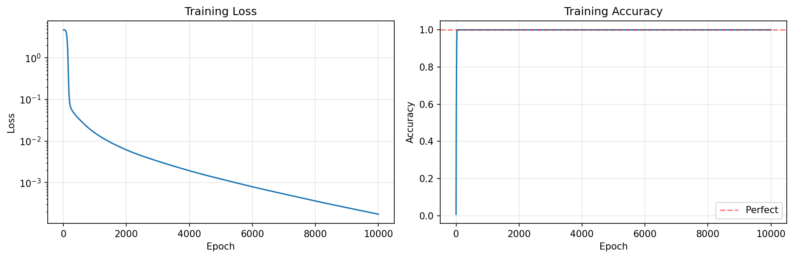
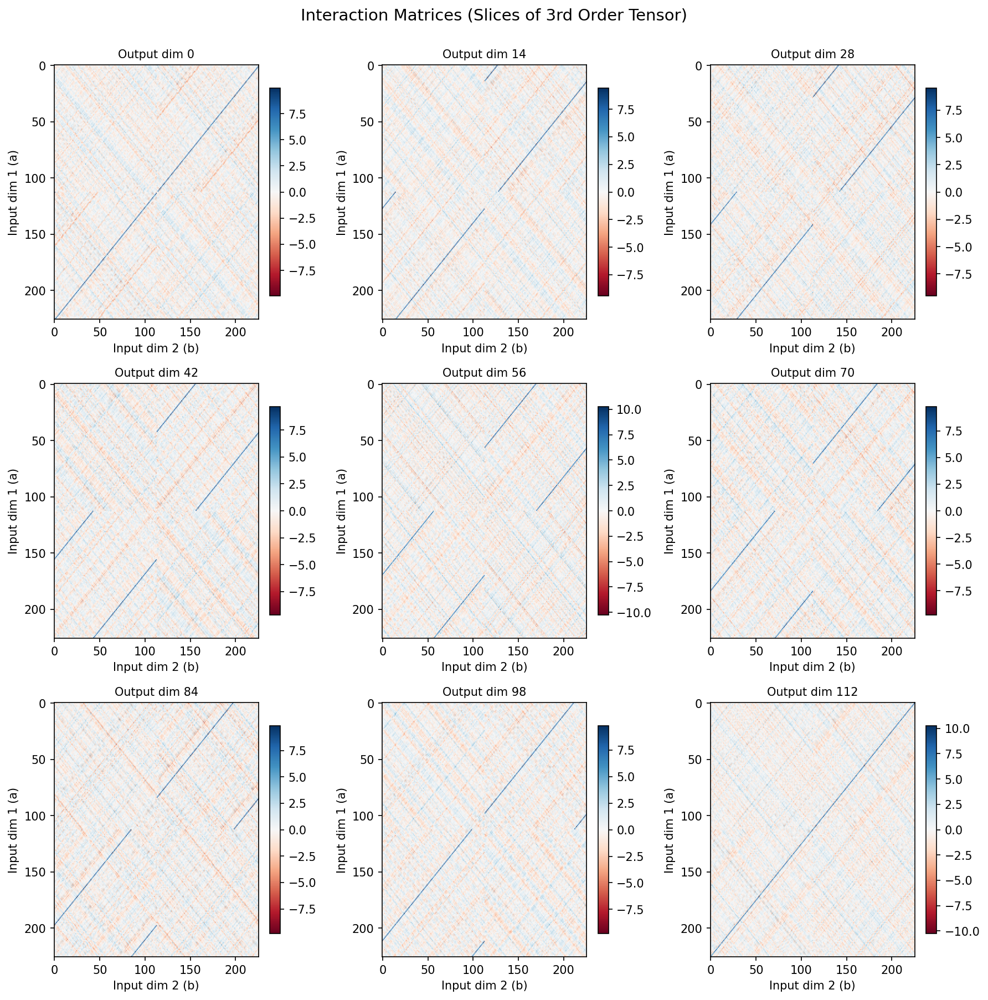
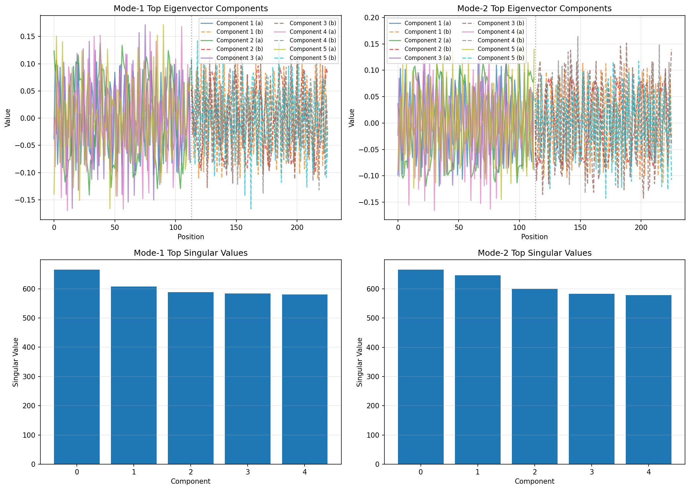

# Bilinear Layers for Modular Arithmetic

An exploration of bilinear neural network layers trained on modular addition, with analysis through tensor decomposition methods. This project reproduces and extends results from recent mechanistic interpretability research on bilinear architectures.

## Overview

This repository implements a **bilinear layer** trained to perform modular addition: `f(a,b) = (a + b) mod 113`. Unlike standard MLPs, bilinear layers can be contracted into exact tensor representations, enabling analytical interpretability methods.

**Key Finding**: Modular arithmetic learning produces a **distributed, multi-component representation** rather than a low-rank structure, suggesting the task fundamentally requires high-dimensional interactions.

## Background

### What are Bilinear Layers?

A bilinear layer computes: `output = W_out(W1(x) ⊙ W2(x))` where ⊙ is element-wise multiplication.

**Why interesting for interpretability?**
- Can be contracted into exact 3rd-order tensors (no sampling error)
- Analytically computable relationships between layers
- Global structure visible through SVD decomposition

### Papers Referenced
- [Bilinear Layers Enable Rapid Learning and Prediction in Sequence Transformers](https://arxiv.org/abs/2410.08417)
- [Interpreting Modular Addition in MLPs](https://www.lesswrong.com/posts/cbDEjnRheYn38Dpc5/interpreting-modular-addition-in-mlps) (Nanda et al.)

## Results

### Training Performance
- **Final accuracy**: ~99%+ after 1000 epochs
- **Architecture**: 226 → 256 → 113 (bilinear layer)
- **Smooth convergence** with proper weight decay



### Tensor Decomposition Analysis

The trained weights were contracted into a 3rd-order tensor `T[i,j,k]` representing how input positions `i` and `j` interact to produce output `k`.



**Singular Value Analysis**: The ratio between consecutive singular values (~1.1) indicates the representation is **NOT low-rank**. This suggests modular addition requires distributed multi-dimensional interactions rather than simple linear projections.



### Key Observations

1. **Distributed Representation**: No single component dominates (unlike highly compressible tasks with ratio >5)
2. **Periodic Structure**: Eigenvectors show oscillatory patterns potentially corresponding to modular arithmetic's cyclic properties
3. **Symmetry**: Mode-1 and Mode-2 show similar structures, confirming addition's commutativity

## Installation

```bash
git clone https://github.com/maximusrafla/bilinear-modular-arithmetic.git
cd bilinear-modular-arithmetic
pip install -r requirements.txt
```

**Requirements**:
- Python 3.8+
- PyTorch
- NumPy
- Matplotlib

## Usage

### Train the model

```bash
python train.py
```

This generates:
- `bilinear_model.pt` - trained model checkpoint
- `results/training_curves.png` - loss and accuracy plots

### Analyze the learned representation

```bash
python analyze.py
```

This generates:
- `results/interaction_matrices.png` - tensor slices
- `results/eigenvector_analysis.png` - SVD components
- `results/eigenvector_heatmaps.png` - structure visualization

## Project Structure

```
bilinear-modular-arithmetic/
├── train.py              # Training script
├── analyze.py            # Tensor decomposition analysis
├── requirements.txt      # Dependencies
├── results/              # Generated visualizations
│   ├── training_curves.png
│   ├── interaction_matrices.png
│   ├── eigenvector_analysis.png
│   └── eigenvector_heatmaps.png
└── README.md
```

## Technical Details

### Model Architecture
- **Input**: Two concatenated one-hot vectors (226-dimensional)
- **Hidden**: 256-dimensional bilinear transformation
- **Output**: 113-dimensional (one per class)
- **Total parameters**: ~350K

### Training Configuration
- **Dataset**: 20,000 random samples from all possible (a,b) pairs
- **Optimizer**: Adam with lr=0.001
- **Weight decay**: 0.01 (critical for generalization)
- **Epochs**: 1000

### Analysis Method

1. **Weight Contraction**: Compute `T[i,j,k] = Σ_h (W1[h,i] × W2[h,j] × W_out[k,h])`
2. **Mode Unfolding**: Reshape tensor for SVD analysis
3. **SVD Decomposition**: Extract top components and singular values
4. **Visualization**: Plot interaction patterns and eigenvector structure

## Interpretability Implications

### Challenges for Feature Extraction
The distributed representation poses challenges for:
- **Sparse Autoencoders**: Would need many features to capture the full algorithm
- **Linear Probing**: Single directions unlikely to capture modular behavior
- **Dimensionality Reduction**: Top SVD components alone insufficient

### Benefits of Tensor Networks
Despite complexity, tensor networks provide:
- **Exact contractability**: Analytical computation of full tensor
- **Global structure**: SVD reveals overall complexity
- **No sampling error**: Deterministic analysis vs activation-based methods

## Future Directions

- Compare to standard MLP representations
- Test different moduli (does structure change with prime P?)
- Explore other operations (multiplication, more complex functions)
- Progressive analysis during training
- Circuit extraction from contracted tensor

## Citation

If you use this code or build upon this work, please cite the original bilinear layer paper:

```bibtex
@article{pearce2024bilinear,
  title={Bilinear MLPs enable weight-based mechanistic interpretability},
  author={Pearce, Michael T. and Dooms, Thomas and Rigg, Alice and Oramas, Jose M. and Sharkey, Lee},
  journal={arXiv preprint arXiv:2410.08417},
  year={2024}
}
```

## License

MIT License - feel free to use and modify!

## Author

Maximus Rafla  
[GitHub](https://github.com/maximusrafla) | [LinkedIn](https://www.linkedin.com/in/maximus-rafla/)

---

*This project explores tensor network interpretability methods for understanding learned algorithms in neural networks.*
