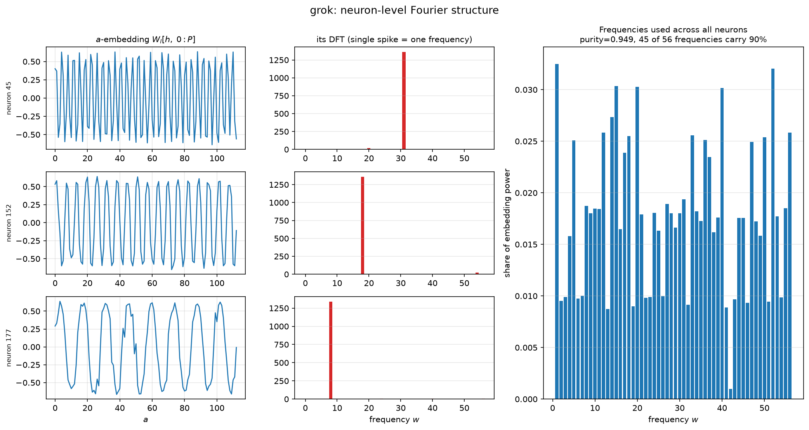
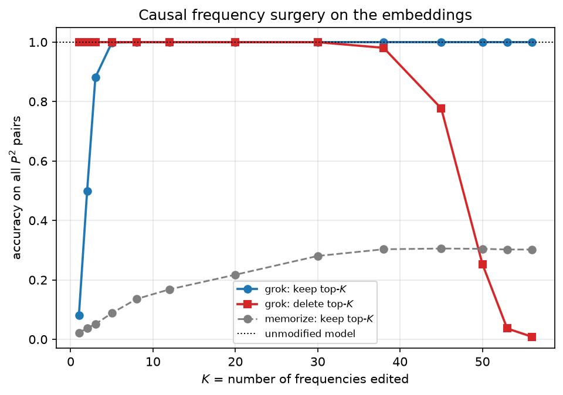
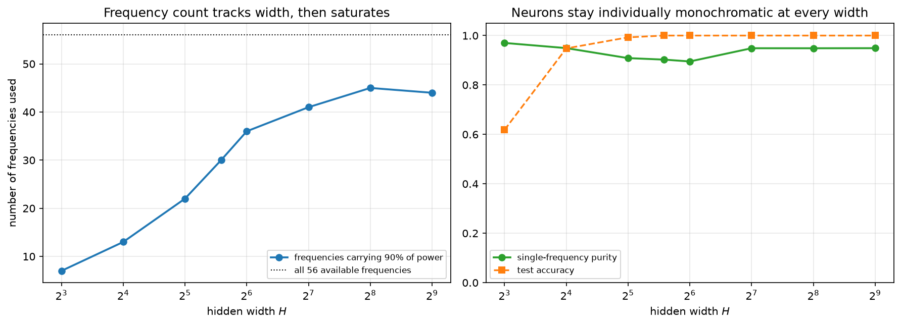
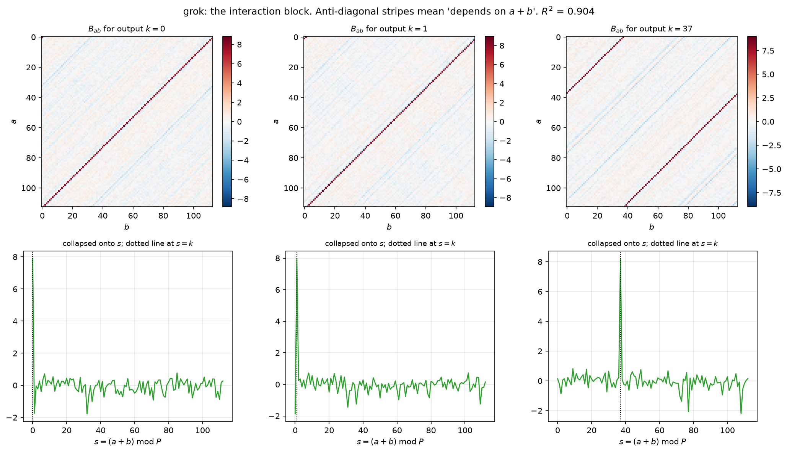
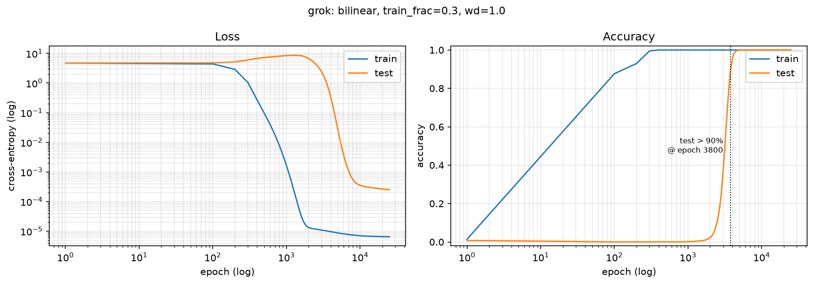
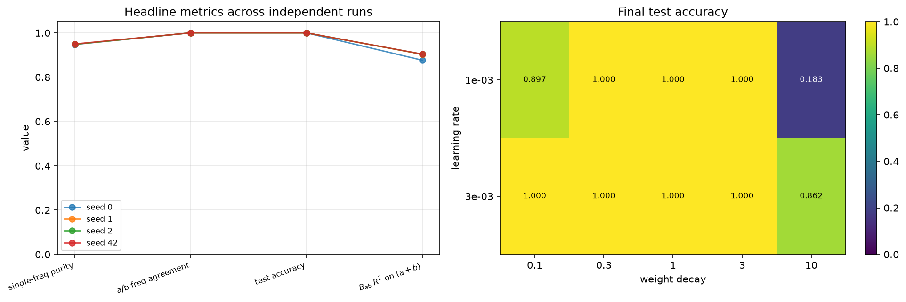

# Reading a modular-addition circuit out of bilinear MLP weights

A bilinear MLP trained on `(a + b) mod 113` groks to **100% test accuracy on
8,938 held-out pairs**, and the algorithm it learned can then be read directly
out of the weights — no activations, no probes, no sampling.

The point of a bilinear layer is that it contracts exactly into a quadratic
form, so weight-space analysis is analytic rather than approximate
([Pearce et al. 2024](https://arxiv.org/abs/2410.08417)). That paper applies the
method to MNIST and to language models. It does not cover modular addition, which
is what this repo does.

Every number below comes from code in this repo, and every table is backed by a
committed JSON file you can check it against:

| claim | produced by | artifact |
|---|---|---|
| main results | `run_all.py` | `results/grok_metrics.json`, `results/memorize_metrics.json` |
| width table | `width_sweep.py` | `results/width_sweep.json` |
| seed table | `sweeps.py` | `results/seed_sweep.json` |
| hyperparameter table | `sweeps.py` | `results/hparam_sweep.json` |

`python verify.py` re-derives every number quoted above — in the tables *and in
the prose* — from those files and exits nonzero on any mismatch. The prose is
checked because that is where the last two errors lived: a table cell copied
from a 30,000-epoch run into a section documenting the 25,000-epoch default,
and a sentence saying eight settings generalised when eight is the number that
ever crossed 90% and seven is the number still there at the end. A check that
compares only cells to JSON passes both.

## The headline result

Each hidden neuron reads `a` and `b` through its own pair of length-113
embeddings. In the grokked model those embeddings are **single Fourier
frequencies**: importance-weighted single-frequency purity is **0.949**, and the
`a`-embedding and `b`-embedding of a neuron land on the *same* frequency with
importance-weighted agreement **1.000** — exactly the condition for the product
term to produce `cos(w(a+b))`.



But the model does **not** concentrate on a handful of "key frequencies" the way
a one-layer transformer does. It spreads across **45 of the 56 available
frequencies**, and it is enormously redundant: deleting the 30 most-used
frequencies from the weights leaves accuracy at **100%**, while the **5**
most-used frequencies on their own already recover **99.8%**.



The likely reason is architectural rather than anything about the task. A
transformer routes every token through one shared embedding matrix of rank
≤ `d_model`, so its neurons are forced to reuse a small frequency basis. Here
each neuron owns its own embeddings, nothing couples them, and nothing rewards
reuse. That predicts the frequency count should track hidden width rather than
sit at a fixed small number — which is what happens:

| hidden width | 8 | 16 | 32 | 48 | 64 | 128 | 256 | 512 |
|---|---|---|---|---|---|---|---|---|
| frequencies used (90% of power) | 7 | 13 | 22 | 30 | 36 | 41 | 45 | 44 |
| single-frequency purity | 0.970 | 0.949 | 0.909 | 0.903 | 0.895 | 0.949 | 0.949 | 0.949 |
| test accuracy | 0.618 | 0.948 | 0.993 | 1.000 | 1.000 | 1.000 | 1.000 | 1.000 |



Neurons stay individually monochromatic at every width, and the count saturates
near the 56 frequencies available. So the model is low-rank *per neuron* and
high-rank *in aggregate*, and those two facts are not in tension.

This is evidence for the shared-embedding explanation, not proof of it: the
clean test would be to give the bilinear MLP a shared low-rank embedding and
check whether the frequency set collapses. That is the obvious next experiment
and it is not done here.

## Where the circuit lives

Each logit is an exact quadratic form in the input:

```
f_k(x) = xᵀ B_k x,     B_k = sym( Σ_h W_out[k,h] · W_l[h,:]ᵀ W_r[h,:] )
```

With `x = [onehot(a); onehot(b)]`, splitting `B_k` into blocks gives

```
B_k = [[B_aa, B_ab],        f_k(a,b) = B_aa[a,a] + B_bb[b,b] + 2·B_ab[a,b]
       [B_abᵀ, B_bb]]
```

so `B_ab` is the only term that couples `a` and `b` — it is where `+ mod P` has
to be implemented. And it plainly is: the anti-diagonal stripe sits at
`a + b = k` and wraps around at the modulus. Collapsing `B_ab` onto
`s = (a+b) mod P` gives a spike exactly at `s = k`.



`B_ab` depends on `a` and `b` only through `(a+b) mod P` with **R² = 0.904** in
the grokked model, versus **0.073** in the memorizing control.

**One caveat that turns out to matter a lot.** A one-hot input only ever reads
the *diagonal* of `B_aa` and `B_bb`. Their off-diagonals are unconstrained by the
task and hold **98.8%** of those blocks' energy. So eigendecomposing the full
226×226 `B_k` — the obvious thing to do — measures mostly unconstrained
directions, and its rank statistics are close to meaningless here. The
participation ratio of the full `B_k` is **112 of 226** for the model that
generalizes and **35 of 226** for the one that memorizes: it runs *backwards*.

## The memorizing control

Everything above is measured against a control trained on the identical
30/70 split with weight decay turned off. It reaches 100% train accuracy and
**0.3%** test accuracy. Without it, none of these statistics could be attributed
to the task rather than to the training regime.

| | grokked (wd=1.0) | memorizing (wd=0) |
|---|---|---|
| test accuracy | **1.000** | 0.003 |
| single-frequency purity | **0.949** | 0.144 |
| `a`/`b` embeddings share a frequency | **1.000** | 0.253 |
| `B_ab` explained by `(a+b) mod P`, R² | **0.904** | 0.073 |
| predictions commute, `f(a,b) = f(b,a)` | **1.000** | 0.102 |
| smallest sufficient frequency set | **5** | 38 |
| frequencies deletable with no loss | **30** | 12 |
| σ₁/σ₂ of the full `B_k` | 1.06 | 1.26 |

Note the last row. σ₁/σ₂ is near 1 for both, and slightly *higher* for the
memorizer. The reason it cannot work as a test is worth spelling out. A single
Fourier term in the cross block is

```
C[a,b] = cos(θ_a + θ_b - φ)  =  cos(θ_a-φ)·cos(θ_b)  -  sin(θ_a-φ)·sin(θ_b)
```

with `θ_a = 2πwa/P`. That is exactly rank 2, and both outer products have the
same norm, since `‖cos‖ = ‖sin‖ = √(P/2)` over a full period. So a *clean*
single-frequency circuit gives `σ₁ = σ₂` exactly. A ratio near 1 is the
signature of Fourier structure, not evidence against it — which is why the old
reading of ≈ 1.1 pointed the wrong way.

None of this is a single-seed accident. `sweeps.py` repeats the grokked run at
seeds 0, 1, 2, 42, varying **both** the initialisation and the train/test split, so
each row is an independent experiment rather than a re-initialisation on a fixed
split. Across all four: test accuracy 1.000 and `a`/`b` frequency
agreement 1.000 every time, with exactly
30 deletable frequencies in every run; purity
0.947–0.950, 42–44 frequencies used, `B_ab` R²
0.876–0.904, sufficient set 5–8. Grokking
onset varies most, 4000–4400 epochs. Rows: `results/seed_sweep.json`.

One honest asymmetry: the grokked model's *predictions* commute perfectly, but
its *logits* do not (relative asymmetry 0.855). Nothing in the training set
rewards logit-level symmetry — `(a,b)` and `(b,a)` are usually not both in a
random 30% split — so the model learned an algorithm that is commutative in its
output without learning commutativity as a weight symmetry.

## Training

The complete input space is 113² = 12,769 pairs, enumerated exactly and split
30/70. Grokking is sharp: test accuracy goes 2% → 95% → 100% between epochs
2,000 and 6,000, first crossing 90% at epoch **3,800**.



It is also robust to hyperparameters, though not unconditionally. **Seven** of
the ten settings below reach 100% test accuracy at the default 25,000 epochs.
The three that miss fail in two different ways. `wd=0.1` at `lr=1e-3` is too
weak: it is still climbing when training stops, having not yet crossed 90%,
and it succeeds at the larger learning rate. `wd=10` fails at both rates — but
only at `lr=1e-3` is it simply too strong. At `lr=3e-3` it crosses 90% at epoch
5,400 and then *decays* to 0.862 by 25,000, so the count of runs that ever
generalise (eight) is not the count that still generalise at the end (seven).
From `results/hparam_sweep.json`:

| final test acc | wd=0.1 | wd=0.3 | wd=1 | wd=3 | wd=10 |
|---|---|---|---|---|---|
| **lr 1e-3** | 0.897 | 1.000 | **1.000** | 1.000 | 0.183 |
| **lr 3e-3** | 1.000 | 1.000 | 1.000 | 1.000 | 0.862 |



Grokking onset moves a lot inside the working region — epoch 1,200 at
`lr=3e-3, wd=1` against 9,200 at `lr=1e-3, wd=0.3` — which is worth knowing
before concluding from a single short run that a setting does not generalise.

## Reproducing

```bash
pip install -r requirements.txt
python run_all.py          # trains both runs + full analysis, ~3 min on a GPU
python width_sweep.py      # the width experiment, ~10 min
python sweeps.py           # seed + hyperparameter sweeps, ~15 min
python verify.py           # re-check every README number against the JSON
```

Or step by step:

```bash
python train.py --name grok     --weight-decay 1.0
python train.py --name memorize --weight-decay 0.0
python analyze.py --name grok --compare memorize
```

| file | what it does |
|---|---|
| `bilinear.py` | model, exact data enumeration, weight contraction, frequency surgery |
| `train.py` | training with a real train/test split; logs test metrics throughout |
| `analyze.py` | all weight-space analysis; writes `results/<run>_metrics.json` |
| `width_sweep.py` | frequency count vs hidden width |
| `sweeps.py` | seed sweep and hyperparameter grid |
| `run_all.py` | trains both runs, then runs the full analysis on each |
| `verify.py` | re-checks every number in this README against `results/*.json` |

Architecture: `226 → 256 → 113`, no biases (a bias would add linear and constant
terms and break the exact quadratic contraction). **144,640 parameters.**

## What this repo used to claim

An earlier version of this project reported that modular addition produces a
"distributed, non-low-rank representation". That conclusion does not survive
checking, and the specific failures are worth listing, because most of them are
the kind that look fine until someone runs the code:

- **There was no test set.** `generate_dataset` drew 20,000 random pairs from a
  space of 12,769 — sampling with replacement, covering 79.2% of it — and then
  evaluated on the exact tensor it trained on. Every reported accuracy was
  training accuracy on memorized data. On the canonical grokking task, where the
  whole question is the train/test gap.
- **The headline finding could not have been supported by the diagnostic used.**
  σ₁/σ₂ ≈ 1 is what a Fourier circuit predicts, not what rules it out. Both
  models here sit near the old ≈ 1.1 figure — 1.06 grokked, 1.26 memorizing — so
  the statistic separates nothing. Worse, on the full `B_k` it is the
  *generalizing* model that looks more distributed (participation ratio 112
  versus 35), because most of that matrix is a subspace the task never
  constrains.
- **`W_out` had the wrong output dimension.** `nn.Linear(hidden_dim, input_dim)`
  produced 226 logits, not 113, leaving 113 dead classes. The contracted tensor
  was therefore 226×226×226, and since the headline figure sliced output indices
  via `linspace(0, 225, 9)`, four of its nine panels showed classes no target
  ever used.
- **The parameter count was wrong**: that model had 173,568 parameters, not the
  "~350K" claimed. (The corrected model here has 144,640, the difference being
  the 113 dead output classes.)
- **The commutativity claim did not follow.** Mode-1 and mode-2 both index the
  same `[a;b]` vector; they are `W_l`'s input space versus `W_r`'s, and comparing
  them says nothing about swapping `a` and `b`.
- **The periodicity claim was confounded**: singular vectors were plotted across
  all 226 positions at once, straddling the `a`/`b` boundary at index 113.
- **One citation was fabricated.** arXiv 2410.08417 was listed as "Bilinear
  Layers Enable Rapid Learning and Prediction in Sequence Transformers". No such
  paper exists; 2410.08417 is "Bilinear MLPs enable weight-based mechanistic
  interpretability", which the same README cited correctly further down. The
  LessWrong post was also attributed to "Nanda et al."; it is by Bart Bussmann,
  investigating one of Nanda's open problems.
- **The README referenced `results/eigenvectors.png` while the script wrote
  `eigenvector_analysis.png`** — it had not been written from an actual run.

The project was AI-assisted, which is not the problem; the problem was that
nothing was checked afterwards. Everything in the current README is generated by
the code in this repo and cross-checked against the JSON it emits.

## References

- Pearce, Dooms, Rigg, Oramas, Sharkey. *Bilinear MLPs enable weight-based
  mechanistic interpretability.* [arXiv:2410.08417](https://arxiv.org/abs/2410.08417)
- Nanda, Chan, Lieberum, Smith, Steinhardt. *Progress measures for grokking via
  mechanistic interpretability.* [arXiv:2301.05217](https://arxiv.org/abs/2301.05217)
- Bussmann. *[Interpreting Modular Addition in MLPs](https://www.lesswrong.com/posts/cbDEjnRheYn38Dpc5/interpreting-modular-addition-in-mlps)*, LessWrong, 2023.

```bibtex
@article{pearce2024bilinear,
  title={Bilinear MLPs enable weight-based mechanistic interpretability},
  author={Pearce, Michael T. and Dooms, Thomas and Rigg, Alice and
          Oramas, Jose M. and Sharkey, Lee},
  journal={arXiv preprint arXiv:2410.08417},
  year={2024}
}
```

## License

MIT.

## Author

Maximus Rafla —
[GitHub](https://github.com/maximusrafla) ·
[LinkedIn](https://www.linkedin.com/in/maximus-rafla/)
